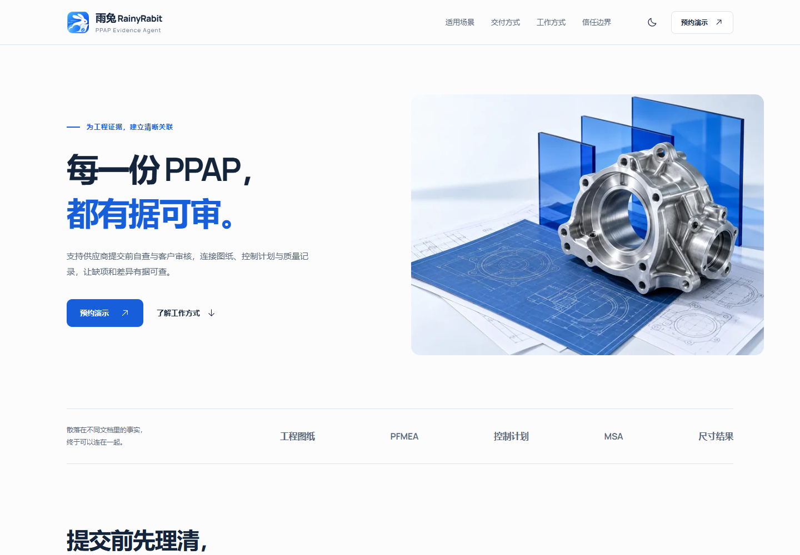
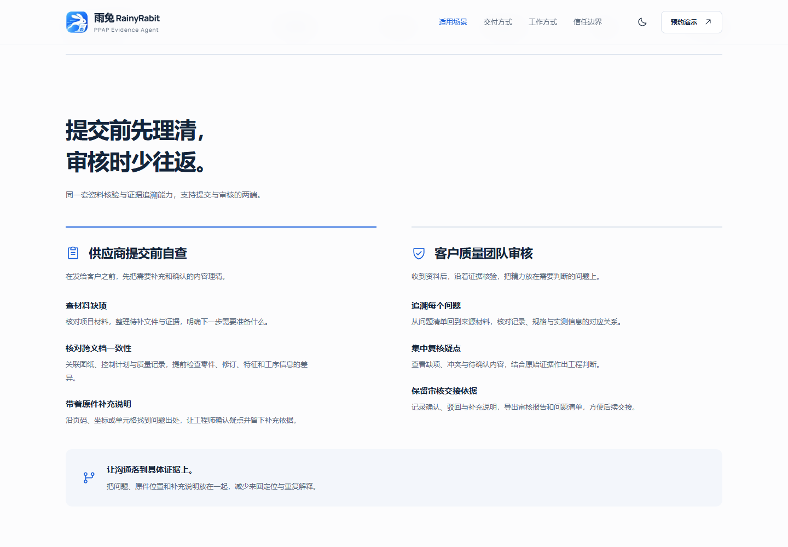

# RainyRabit PPAP Evidence Agent 官网

用于产品宣发、能力介绍和演示预约的中文官网。页面面向供应商与客户质量团队，展示提交前自查、材料缺项与跨文档一致性核对、待补证据定位及人工复核的产品思路，以及本地部署、网页订阅和 Web API 定制三种交付方式。界面中的材料与核验状态是说明性演示。

此仓库仅包含宣传官网，不包含审核服务、模型、客户材料、业务数据库或生产系统凭据。



## 本地预览

使用 Node.js 22.x 和 npm。依赖版本由 `package-lock.json` 固定。

```sh
npm ci
npm run dev
```

生成并预览发布文件：

```sh
npm run build
npm run preview
```

开发地址与预览地址以终端实际输出为准。构建结果位于 `dist/`。

构建时会把实际 React 页面预渲染为静态 HTML，首屏文案、产品介绍、导航锚点和联系信息直接包含在 `dist/index.html` 中，可供搜索引擎读取。浏览器加载后再启用交互；部署时仍然只有静态文件，不需要运行 Node.js 服务。临时渲染文件存放在已忽略的 `node_modules/.cache/` 中，构建结束后自动清理，不进入发布目录。

每次构建会检查首屏标题、`#scenarios`、`#delivery`、`#method`、`#boundary`、`#contact`、页脚以及标题、摘要和分享元信息，缺失时直接报错。

## Vercel 发布

1. 在 [Vercel 新建项目](https://vercel.com/new)中导入 GitHub 仓库 `Ar1haraNaN7mI/RainyRabitPPAPAgent`。
2. 使用以下设置并点击 Deploy。仓库已提供 `vercel.json`，通常会自动应用。

| 设置 | 值 |
| --- | --- |
| Framework Preset | Vite |
| Root Directory | `./`（仓库根目录） |
| Node.js Version | 22.x |
| Install Command | `npm ci` |
| Build Command | `npm run build` |
| Output Directory | `dist` |
| 必填环境变量 | 无 |

这是使用页面锚点导航的静态单页官网，不需要后端服务或 SPA 路由重写。连接 GitHub 后，生产分支更新可由 Vercel 自动发布。参见 [Vercel 的 Vite 部署文档](https://vercel.com/docs/frameworks/frontend/vite)。

构建会优先读取 `VITE_SITE_URL` 作为正式网站地址；未设置时，使用 Vercel 提供的 `VERCEL_PROJECT_PRODUCTION_URL` 自动获取实际生产域名，预览构建也指向该生产域名。由此生成 canonical、`og:url`、绝对分享图片地址和 `sitemap.xml`，并更新 `robots.txt` 的站点地图地址。本地构建若两者均无，则不生成域名相关标记，不猜测域名。参见 [Vercel 系统环境变量](https://vercel.com/docs/environment-variables/system-environment-variables)。

绑定自定义域名后，可在 Vercel 中设置 `VITE_SITE_URL` 为完整的网站根地址，例如 `https://your-domain.example`，然后重新部署，以明确指定规范地址。该变量是公开网址，不应填入凭据。

## 设计与素材用途

视觉方向为工程证据档案：克制的纸张底色、清晰的编号与细线、蓝色重点和可阅读的产品流程示意。设计拨盘为 **7 / 4 / 3**：布局差异度 7、动效强度 4、信息密度 3。

React Bits 组件从官方实时注册表获取，采用 TypeScript + CSS 版本，并按页面需要适配无障碍、减少动态效果与触摸设备：

| 素材 | 官网页面用途 | 官方来源 |
| --- | --- | --- |
| AnimatedContent | 内容段落的轻量进入动效，引导阅读节奏 | [注册表源码](https://reactbits.dev/r/AnimatedContent-TS-CSS.json) |
| GlareHover | 主行动入口的短暂掠光，提示可点击性 | [注册表源码](https://reactbits.dev/r/GlareHover-TS-CSS.json) |
| SpotlightCard | 证据链与人工复核卡片的局部聚光，辅助聚焦当前内容 | [注册表源码](https://reactbits.dev/r/SpotlightCard-TS-CSS.json) |

Phosphor Icons 用于统一的界面图标。Manrope Variable 用于英文与数字，字体随网站本地提供；中文使用系统字体。第三方来源与许可证见 [THIRD_PARTY_NOTICES.md](./THIRD_PARTY_NOTICES.md)。

## 内容维护

`#scenarios` 并列说明供应商提交前自查与客户审核的用途。两端都围绕问题清单、原件位置与补充说明沟通；官网不承诺自动通过客户审批，也不使用未经依据的准确率或效率数字。



- 主页面内容与交互：`src/App.tsx`。
- 页面样式：`src/styles.css`。
- 标题、摘要与社交分享元信息：`index.html`。
- 站点域名与 SEO 构建处理：`scripts/build.mjs`。
- 构建阶段页面渲染入口：`src/entry-server.tsx`。
- 请保留导航锚点 `#scenarios`、`#delivery`、`#method`、`#boundary`、`#contact`，避免现有外链失效。
- 对外发布前核对联系渠道、交付范围和产品文案，不在官网中加入客户材料。

## 验证状态

2026-09-27 的供应商场景更新已通过生产构建与静态 HTML 校验，实际检查 320px、390px、820px、1024px 和 1440px 布局，以及深浅主题、新场景入口、流程及交付标签页、预约弹窗和微信复制成功反馈。

2026-09-26 的历史移动端 Lighthouse 本地生产预览结果为性能 98、无障碍 100、最佳实践 100、SEO 100；本轮未重测 Lighthouse。详细检查范围与截图说明见 [验收记录](./docs/VALIDATION.md)。
